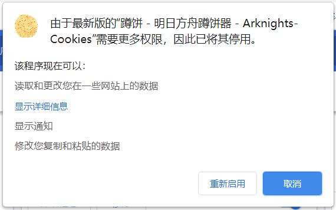
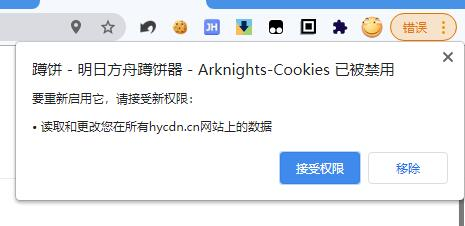

<!--suppress CheckImageSize, HtmlDeprecatedAttribute -->

<h1 align="center">小刻食堂</h1>

    <h3>用于实时抓取兔兔发的动态</h3>
    <h3>跟着小刻一起来找饼吧</h3>
    <h4>自由的兔兔把烙好的饼到处藏，就由小刻把它们都找出来吧！</h4> 
    <h3>欢迎Star</h3>
    

    兔兔你的饼还没发完，现在还不能休息哦

# 主要功能

> - 找出兔兔在各个地方藏的饼:
>   - 官方 B 站
>   - 官方微博
>   - 官方网站
>   - 游戏内公告
>   - 朝陇山、一拾山微博
>   - 泰拉记事社微博
>   - 泰拉记事社官网
>   - 塞壬官网
>   - 网易云音乐
>   - 鹰角网络微博
>   - 明日方舟终末地
>   - 以及其它的总共38个数据源
> - 一键跳转以上网站
> - 一键跳转详细内容界面
> - 一键复制饼内容文本
> - 一键通过饼内容生成图片并复制（右键复制九宫格）
> - 一键跳转方舟小工具
> - 一键跳转二创，作业视频
> - 大版本更新、闪断更新提醒
> - 快速计算理智回复
> - 快速查看今日开放材料
> - 使用窗口查看列表
> - 列表搜索 (按 Enter 键触发)
> - 查看大图 (鼠标悬浮图片右上角)
> - 企鹅物流材料掉落关卡查询 (按 Enter 键触发)

# 演示视频

记得给个三连，转发支持一下，让更多人看到呀

# 注意事项

> 下载安装包不是下载项目文件，点击[这里](https://github.com/Enraged-Dun-Cookie-Development-Team/Dun-Cookie-Vue/releases)进入下载地址列表

> 因为添加了网站权限变更，所以 3.1.9 版本前的蹲饼器，如果在更新弹出要求新的权限，请博士先允许新的权限！

  
图为Chrome弹出的权限申请的其中一个示例页面，如果看到请同意

   
  
  

# 界面样式

  
图片收起、展开与九宫格

  
生成图片快捷复制

  
菜单界面

  
设置界面

  
夜间模式

  
窗口模式

# 安装方法

  
<strong style="font-size: 20px">Firefox特殊设置</strong>

>   Firefox默认无法将图片保存进粘贴板，如果需要自动保存粘贴板跟随以下配置，否则只能手动右键复制
>   1. 打开火狐，在地址栏输入`about:config`，进入配置页
>   2. 点击 接受风险并继续
>   3. 在搜索框输入`dom.events.asyncClipboard.clipboardItem`
>   4. 双击或者点后面双箭头切换为`true`，完成

## 应用商店安装
[Chrome商店页面](https://chrome.google.com/webstore/detail/gblmdllhbodefkmimbcjpflhjneagkkd)  
[Microsoft Edge商店页面](https://microsoftedge.microsoft.com/addons/detail/%E5%B0%8F%E5%88%BB%E9%A3%9F%E5%A0%82-%E6%98%8E%E6%97%A5%E6%96%B9%E8%88%9F%E8%B9%B2%E9%A5%BC%E5%99%A8-arknight/jimmfliacfpeabcifcghmdankmdnmfmn)  
[Firefox商店页面](https://addons.mozilla.org/zh-CN/firefox/addon/%E5%B0%8F%E5%88%BB%E9%A3%9F%E5%A0%82-%E6%98%8E%E6%97%A5%E6%96%B9%E8%88%9F%E8%B9%B2%E9%A5%BC%E5%99%A8-arknights-cookies)  

## 压缩包安装

**Chrome/Edge用户强烈建议从商店直接安装插件，建议只在不方便访问商店时才考虑使用压缩包安装**

新版本的压缩包会发布在[Releases](https://github.com/Enraged-Dun-Cookie-Development-Team/Dun-Cookie-Vue/releases)和[QQ 群](https://jq.qq.com/?_wv=1027&k=Vod1uO13)内

  
Chrome 安装方法

> - 推荐 [Chrome 应用商店](https://chrome.google.com/webstore/detail/%E8%B9%B2%E9%A5%BC-%E6%98%8E%E6%97%A5%E6%96%B9%E8%88%9F%E8%B9%B2%E9%A5%BC%E5%99%A8-arknights-cook/gblmdllhbodefkmimbcjpflhjneagkkd)
> - 下载 zip 通过开发者模式加载已解压的扩展程序
>   1. 先解压到任意文件夹
>   2. 地址栏输入`chrome://extensions/`，回车
>   3. 右上角打开开发者模式
>   4. 点击“加载已解压的扩展程序”
>   5. 选择解压后的整个插件文件夹完成安装
>
> PS: 可以通过地址栏输入`chrome://settings/?search=后台`找到“关闭 Google Chrome 后继续运行后台应用”，选择运行后台扩展程序的使用

  
Edge 安装方法

> - [Edge 应用商店](https://microsoftedge.microsoft.com/addons/detail/%E5%B0%8F%E5%88%BB%E9%A3%9F%E5%A0%82-%E6%98%8E%E6%97%A5%E6%96%B9%E8%88%9F%E8%B9%B2%E9%A5%BC%E5%99%A8-arknight/jimmfliacfpeabcifcghmdankmdnmfmn?hl=zh-CN)
> - 下载 zip 通过开发者模式加载已解压的扩展程序
>   1. 先解压到任意文件夹
>   2. 地址栏输入`edge://extensions/`，回车
>   3. 左下角打开开发者模式
>   4. 点击已安装的扩展右边的第一个图标“加载解压缩的扩展”
>   5. 选择解压后的整个插件文件夹完成安装
>
> PS: 可以通过地址栏输入`edge://settings/?search=后台`找到“关闭 Microsoft Edge 后继续运行后台应用关闭”，选择运行后台扩展程序的使用

  
Firefox 安装方法

> - [Firefox应用商店](https://addons.mozilla.org/zh-CN/firefox/addon/%E5%B0%8F%E5%88%BB%E9%A3%9F%E5%A0%82-%E6%98%8E%E6%97%A5%E6%96%B9%E8%88%9F%E8%B9%B2%E9%A5%BC%E5%99%A8-arknights-cookies/)
> - Firefox目前不允许通过zip安装

  
QQ浏览器 安装方法

> 1. 先解压到任意文件夹
> 2. 地址栏输入`qqbrowser://extensions/manage`，回车
> 3. 右上角打开开发者模式
> 4. 点击“加载已解压的扩展程序”
> 5. 选择解压后的整个插件文件夹完成安装

  
360安全浏览器 安装方法

> 1. 先解压到任意文件夹
> 2. 点击地址栏旁边扩展中心图标
> 3. 点击已安装的扩展
> 4. 勾选开发者模式
> 5. 点击“加载已解压的扩展程序”
> 6. 选择解压后的整个插件文件夹完成安装

## 在手机上使用蹲饼

[加群在群里下载](https://jq.qq.com/?_wv=1027&k=Vod1uO13)  
[点击前往手机端仓库](https://github.com/Enraged-Dun-Cookie-Development-Team/Dun-Cookie-Flutter)

# 更新日志

[点击查看](docs/CHANGELOG.md)

# 意见建议反馈通道

    我们很欢迎博士们对我们的蹲饼器指指点点

> - github 上的[issues](https://github.com/Enraged-Dun-Cookie-Development-Team/Dun-Cookie-Vue/issues)可以发送问题或建议
> - 点击[这里加群](https://jq.qq.com/?_wv=1027&k=Vod1uO13)一起聊天 群号：362860473

# 开发人员

> - [蓝芷怡](https://github.com/LiuZiYang1)
> - [洛梧藤](https://github.com/lwt-414)
> - [云闪](https://github.com/Yun-Shan)
> - [别喵了](https://github.com/ablupi)

# LOGO 画师

> - [不画涩图の企鹅](https://pipie457.lofter.com/)

# 鸣谢

> - [@Houdou](https://github.com/Houdou) —— 帮我解决了疑难杂症
> - 蹲饼测试组成员
> - [HYPERGRYPH](https://www.hypergryph.com/#/)
> - 脚手架支持 —— [chrome-extension-cli](https://github.com/SlowSoulWen/chrome-extension-cli)
> - 选择小刻食堂的你们
